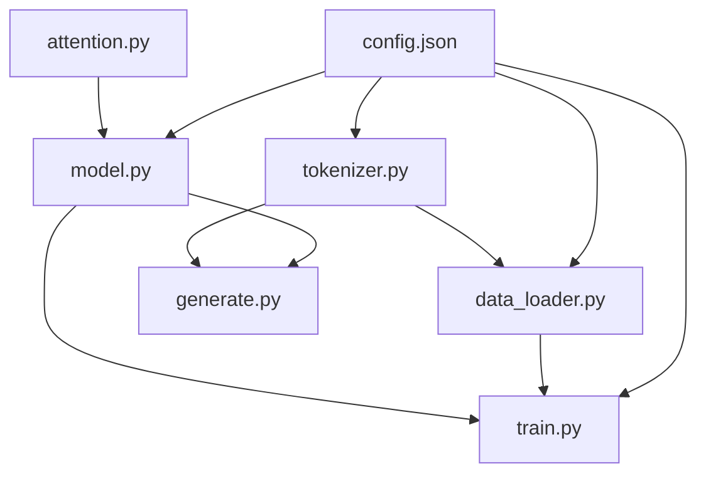

# 项目治理与架构说明（组长 / PM + 架构师）

本文档服务于：**排期、分工对齐、技术边界与验收共识**。理论基础为 Sebastian Raschka《Build a Large Language Model (From Scratch)》（以下简称**原书**）；实现以本仓库 [`src/mini_llm/`](../src/mini_llm/) 为准，[`../LLMs-from-scratch/`](../LLMs-from-scratch/) 仅作**对照与只读参考**。

相关文档：

- 分工与文件名：[TEAM_WORK.md](./TEAM_WORK.md)
- 接口契约：[MODULE_INTERFACES.md](./MODULE_INTERFACES.md)
- 范围冻结：[SCOPE.md](./SCOPE.md)
- 书本代码索引：[REFERENCE.md](../REFERENCE.md)

---

## 1. 原书章节 → 本项目模块（知识映射）

| 原书章节 | 核心概念（执行摘要） | 本项目交付物 | 负责人 |
|----------|----------------------|--------------|--------|
| 第 2 章 | 文本、BPE/分词、滑动窗口、批数据 | `tokenizer.py`、`data_loader.py` | 同学 A |
| 第 3 章 | 自注意力、因果掩码、多头 | `attention.py` | 同学 B |
| 第 4 章 | LayerNorm、FFN、TransformerBlock、GPT 堆叠 | `model.py` | 同学 C |
| 第 5 章 | 预训练循环、交叉熵、优化器、学习率、checkpoint、train/val | `train.py`（根目录入口） | 同学 D |
| 第 6 章 | 分类头等微调（可选路线 A） | 与 `generate.py`、配置扩展配合 | 同学 E / 全组 |
| 第 7 章 | 指令数据与微调（可选路线 B） | 同上 | 同学 E / 全组 |

**组长需推动共识的一条线**：训练目标始终是「预测下一 token」；第 6/7 章是在此之上的**任务形式变化**（分类头、指令格式），不是推翻第 2–5 章接口。

---

## 2. 系统架构（数据与控制流）

自顶向下：

1. **配置**：[`configs/config.json`](../configs/config.json) 定义 `data` / `model` / `train` / `device` / `output_dir`，全组以它为**单一事实来源**（改超参走配置，避免魔法数散落）。
2. **数据面**：语料 → `tokenizer` → token 序列 → `data_loader` 产出 `(input, target)`，形状 `[B, T]`。
3. **模型面**：`input` → `GPTModel`（内部使用 `attention` 与块）→ `logits` `[B, T, vocab_size]`。
4. **训练面**：`train.py` 负责设备、优化器、loss（见 MODULE_INTERFACES）、周期性验证、checkpoint、可恢复训练。
5. **推理面**：`generate.py` 加载权重与 tokenizer，按 temperature / top-k 等策略自回归生成。

---

## 3. 依赖与并行策略（排期用）

- **可并行（早期）**：A（数据）、B（注意力）、C（模型）可在**约定张量形状**的前提下并行开发；B/C 可用**合成张量**单测，不必等真实语料。
- **第一次集成锚点（M1）**：A 的 tokenizer 与 `vocab_size`、上下文长度与 `config.model` 一致；C 的 `forward` 满足 MODULE_INTERFACES；三者由 D 在 `train.py` **跑通一步 loss 下降的小实验**（小数据、少步即可）。
- **第二次集成锚点（M2）**：D 完成 checkpoint 与验证集指标；E 基于同一 checkpoint 在 `generate.py` 产出可读文本。
- **第 3 周**：在 [WEEK3.md](./WEEK3.md) 与 [SCOPE.md](./SCOPE.md) 内二选一（分类 vs 指令），避免范围蔓延。

**阻塞关系简述**：D 的完整训练依赖 A+C；E 的生成依赖 C +（通常）A 的 tokenizer；微调路线依赖 M2 的稳定预训练权重。

---

## 4. 各模块「完成定义」（Definition of Done）

用于评审与合并，避免「能 import 就算完成」。

| 模块 | DoD（最低标准） |
|------|-----------------|
| `tokenizer.py` | 与 `config.model.vocab_size` 一致；可对样本文本 encode/decode；行为可文档化（若用 tiktoken 亦需写明版本与编码名）。 |
| `data_loader.py` | 产出 `input`/`target` `[B, T]`；与 `context_length` 对齐；训练/验证划分可复现（seed）。 |
| `attention.py` | 因果掩码下注意力与已知形状 case 数值稳定；单测或小脚本对比形状与掩码性质。 |
| `model.py` | `forward` 输出 `[B, T, vocab_size]`；与配置中层数、头数、维度一致。 |
| `train.py` | 交叉熵与 MODULE_INTERFACES 一致；train/val；保存与加载 checkpoint；日志或打印可追踪 loss。 |
| `generate.py` | 至少实现 temperature 与 top-k；与训练 tokenizer 一致；可从 checkpoint 加载推理。 |

---

## 5. Harness Engineering（本项目中的操作性定义）

「Harness」在此指：**用可重复的约束把多人协作与模型训练绑在可控轨道上**，避免各自为政。具体落为五类「约束带」：

### 5.1 契约 Harness（接口）

- [MODULE_INTERFACES.md](./MODULE_INTERFACES.md) 为**模块间契约**；变更需组长或评审同意后更新文档。
- 张量形状、loss 公式、`config` 字段名为**硬约束**；实现可不同，边界必须对齐。

### 5.2 对照 Harness（参考实现）

- [`LLMs-from-scratch/pkg/llms_from_scratch/`](../LLMs-from-scratch/pkg/llms_from_scratch/) 与章节脚本为**只读对照**；差异须在 PR/合并说明中写清（例如为教学简化处）。
- 索引路径见 [REFERENCE.md](../REFERENCE.md)。

### 5.3 集成 Harness（锚点）

- **M1**：一步训练冒烟（小配置、短步数、loss 有限）。
- **M2**：checkpoint → `generate.py` 端到端字符串输出。
- 组长在合并主干前确认锚点通过或登记已知问题与修复时限。

### 5.4 可复现 Harness（配置与种子）

- 超参集中在 `configs/config.json`；`train` 内固定随机种子策略并文档化（含 CUDA）。
- 环境见 [ENVIRONMENT.md](./ENVIRONMENT.md)；全组 Python 版本区间一致。

### 5.5 度量 Harness（验收）

- **训练**：train/val loss 曲线或等价日志；checkpoint 文件存在且可加载。
- **生成**：固定 prompt + 采样参数下输出可重复（给定 seed 时）或记录随机性来源。

---

## 6. 组长职责清单（PM + 架构）

| 领域 | 行动项 |
|------|--------|
| 范围 | 维护 SCOPE / WEEK3 选择；拒绝当期不做项进入主干。 |
| 接口 | 主持 MODULE_INTERFACES 变更；冲突时拍板形状与配置字段。 |
| 集成 | 组织 M1/M2；合并前跑通或指派修复责任人。 |
| 风险 | 并行开发导致的接口漂移 → 用契约 + 短周期合并缓解。 |
| 对外 | PPT、报告、演示脚本与「我们实现了什么 / 对照书哪一章」一致。 |

---

## 7. 建议协作节奏（可按课程周调整）

- **每周固定短会**：对齐接口变更、阻塞项、锚点日期。
- **合并策略**：小步合并到 `main`（或约定分支），避免长期大分支。
- **文档即共识**：分工以 [TEAM_WORK.md](./TEAM_WORK.md) 为准；与本文 DoD 冲突时以**更严格的验收**为准。

---

## 8. 参考书与版权提示

原书电子版/EPUB 请自行通过合法渠道获取；团队仓库的 `materials/` 仅放**已获授权**的参考资料，**勿提交**未授权完整书籍文件至公开仓库（见 [REFERENCE.md](../REFERENCE.md)）。
