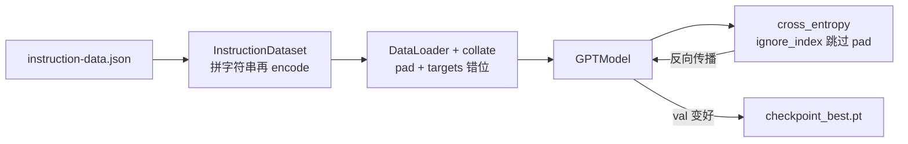

# 训练报告：指令微调（Small 冒烟配置）

**实验名称：** `instruction_sft_small`  
**关联 REQ：** [REQ-P3-01 · Ch7 指令 SFT](REQ-P3-01_Ch07InstructionSFT.md)、[对齐细则](REQ-P3-01SUB_Ch07InstructionBookAlignment.md)、[REQ-P3-02 · 质检与优化](REQ-P3-02_InstructionSFTEvalAndQuality.md)  
**配置文件：** [`configs/config_instruction_small.json`](../configs/config_instruction_small.json)  
**报告日期：** 2026-05-05  
**状态：** 单次跑通（冒烟规模，非全书级收敛实验）

---

## 〇、这篇报告怎么读（建议顺序）

如果你感觉「字都认识，连起来不知道在说什么」，可以按下面顺序啃：

1. **下一节「用 Java / 日常话理解」**：先不管数字，弄清「在考什么试」。  
2. **「一条样本长成什么样」**：看模型输入的字符串长什么样。  
3. **「你的日志一行一行」**：对照你终端里**每一行**在干什么。  
4. **「术语表」**：搞清这里的 `val_loss` **为什么不能**和预训练的 3.31 比大小。  
5. **后面原来的「一、二、三」**：需要复盘配置或复现命令时再翻。

附录 A 仍是完整日志摘录。

---

## 深入浅出：先建立直觉

### 用 Java / 工程类比（不追求精确，只求方向对）

| 概念 | 白话 |
|------|------|
| **预训练（WikiText，loss≈3.31 那段）** | 模型做了一整套「给百科正文，猜下一个英文词」的题海；**考卷格式**是连续段落。 |
| **指令微调（本报告）** | 换了一套 **「作业纸格式」**：固定有 `### Instruction:`、可选 `### Input:`、后面要答 `### Response:`。**考的还是「猜下一个词」**，但纸上印刷格式变了。 |
| **loss（7.9 → 4.1）** | 在这套**新格式**的考卷上，模型一开始不会填，扣分多（loss 高）；练了十几个 step 后填得顺一点，扣分变少。 |
| **不能把 3.31 和 8.0 直接比** | 等价于：你不能说「期末高数 85 分」比「英语六级 420 分」高，因为**科目不同**。这里一个是 **Wiki 连续文本**，一个是 **带模板的指令 JSON 拼段**。 |

### 一条训练样本「长什么样」（示意）

每条 JSON 会被拼成**一整段英文**，模型训练的是：**从左到右，每个位置预测下一个 token**（和预训练一样）。结构大致是：

```text
Below is an instruction that describes a task. Write a response ...

### Instruction:
（题目）

### Input:
（可有可空）

### Response:
（标准答案全文）
```

短样本要和其他样本 **padding 对齐** 成矩阵；pad 位置在 `targets` 里标成 `-100`，**不参与 loss**（详见 [`m07_instruction_finetune`](../src/mini_llm/m07_instruction_finetune/__init__.py)）。

### 你的日志：从上到下每一块在说什么

下面按**你实际跑出来的顺序**解释（深度版）。

| 输出 | 含义 |
|------|------|
| `Dataset sizes: train=24, val=24, test=24` | 配置里开了 `smoke_trim: 24`：在按比例划分之后，**三套数据都只留前 24 条**，用来验证代码能跑。**不是**全书默认的「尽量多数据」。 |
| `Device: mps` | 用 Apple GPU（Metal）算矩阵；和 `cuda` 一样是加速设备。 |
| `Loading pretrained checkpoint: .../gpt2_small_wikitext103/checkpoint_best.pt` | 从 **Wiki 预训练** 得到的权重出发，而不是随机初始化。 |
| `Loaded pretrained weights (best_val_loss=3.3092...)` | 这个 **3.31** 是**预训练当时**在 **Wiki 验证集**上最好的 loss，**不是**本次 SFT 的 loss。相当于老成绩单夹在作业本里。 |
| `Parameters (full finetune): 163,009,536` | 所有 Transformer 参数都参与更新（第六章分类是「换头 / 部分解冻」，这里更接近「整网一起动」）。 |
| `Instruction SFT: 1 epochs, batch=2, eval every 2 steps (eval_iter=3)` | **1** 轮数据；每批 **2** 条样本；每训练 **2** 个 step 就打一次 `train_loss`/`val_loss`；打分时 train/val **各只抽前 3 个 batch** 算平均（快，但不等于「扫完整个 val」）。 |
| `Ep 1 Step 0000 ... train_loss=7.8971 val_loss=7.9968` | **Step 0**：做完第 1 个训练 step 后 **global_step 变成 0**，此时 `0 % eval_freq == 0`，所以立刻评估一次。train/val 的 loss 都还在 **7～8**：模型还在用「维基脑」硬答「作业纸格式」。 |
| `-> New best val_loss=... saved` | 只要这次 `val_loss` 比**历史上**最好的一次低，就 **覆盖写入** `runs/instruction_sft_small/checkpoint_best.pt`。第一轮时「历史最好」是 +∞，所以 **7.99 也会存一次 best**（这是代码逻辑，不是说你愿意以 7.99 当最终模型）。 |
| 后面 Step 2、4、6… | 每 2 步评估一次；**val 持续下降**，所以每次都会 `saved`。**最后一次写入**的是在 Step 10 时 **val=4.0941** 那一版权重。 |
| `End epoch 1: train_loss=3.7223 val_loss=3.9531` | **本 epoch 内所有训练 batch 打完**后，脚本再抽 **eval_iter=3** 个 batch 估一遍。这里的 **3.95** 和 Step 10 的 **4.09** 都是「**小样本抽查平均分**」，**抽查的 batch 不一定相同**，所以可以 3.95 略好于 4.09；**脚本没有在 epoch 末尾用 3.95 再覆盖 checkpoint**（若你用 3.95 更信，需要改 `finetune_instruction.py` 或在最后加一次 save）。 |
| `Best checkpoint -> ... (best_val_loss=4.0941)` | 总结：**磁盘上 best 文件**对应的是训练过程中 **若干次 eval 里 val 最低的那次**（这里是 Step 10），不是epoch尾那一行。 |

### `eval_iter=3` 到底测了什么？（容易误会的一点）

可以把 **验证集 DataLoader** 想成一本习题册有很多页（很多 batch），每页 2 道题（`batch_size=2`）。

- **完整评测**：把整本习题册做完再算平均分。  
- **当前脚本**：每次只**翻开前 3 页**算平均，用来**看趋势够不够降**（省时间）。

所以：

- 日志里的 `val_loss` **是「前 3 个 val batch 的平均 loss」**，不是全 val 集的严格指标。  
- **趋势可信**（一直在降说明在学）；**绝对数值**若要写论文级报告，要把 `eval_iter` 调大或改成扫全 val。

### 若画成数据流（和代码对齐）



---

## 一、我们做了什么（配置摘要）

在 **WikiText-103 上训好的 GPT-2 Small**（`runs/gpt2_small_wikitext103/checkpoint_best.pt`，预训练 best **val_loss ≈ 3.31**）上，做 **第七章风格的指令监督微调（SFT）**：数据为书本 `instruction-data.json` 模板（instruction / input / output），损失仍是整段上的下一词交叉熵，pad 位 `ignore_index=-100`。

| 项目 | 内容 |
|------|------|
| 硬件 | Apple Silicon，**MPS** |
| 参数量 | 全量微调 **163,009,536（≈163M）** |
| 数据规模 | `smoke_trim: 24` → train **24**、val **24**、test **24**（各划分仅保留 24 条，用于链路验证） |
| 训练 | **1** epoch，`batch_size=2`，`lr=5e-5`，`weight_decay=0.1`，`allowed_max_length=512`，`grad_clip=1.0` |
| 训练中评估 | 每 **2** 步（`eval_freq`）打一次 `train_loss` / `val_loss`；每次只用 DataLoader 里前 **`eval_iter=3`** 个 batch 估平均 loss |
| 壁钟时间 | 约 **16 秒** |

输出权重：`runs/instruction_sft_small/checkpoint_best.pt`。

---

## 二、数字与结论（压缩版）

### 2.1 为什么 SFT 起步 loss 比 3.31「高很多」？

**3.31** 是 **Wiki 连续正文** 考卷上的分；**8** 左右是 **指令模板考卷** 上的分。科目不同，**没有「从 3.31 退步到 8」** 这种说法；只是换任务后重新学。

训练中 **val（抽查）从约 7.99 → 约 4.09**，说明在新格式上 **预测下一个词** 在变好。

### 2.2 困惑度（只看数量级）

\( \mathrm{PPL} \approx e^{\mathrm{loss}} \)。val≈4.1 → PPL 大约 **60** 量级。  
这与预训练 val 3.3 → PPL≈27 **不可横向谁好谁坏**，因数据与 mask 不同。

### 2.3 和「像 Chat 一样听话」还差什么？

本配置是 **Small 冒烟**。数据 24×3、1 个 epoch，**不是为了对话质量**。要肉眼质变：去 `smoke_trim`、加 epoch、数据全，并使用 `configs/config_instruction_train_small.json` 的全 val 质检口径。Medium checkpoint **不作为本轮 SFT 底座**。

---

## 三、术语表（读懂日志够用）

| 词 | 在本实验里的意思 |
|----|------------------|
| **step** | 参数更新一次 = 处理完 `batch_size` 条样本并 `optimizer.step()` 一次。 |
| **epoch** | 把训练集 DataLoader **完整扫一遍**（本配置 train 只有 24 条、batch=2、`drop_last=True`，步数很少）。 |
| **train_loss（日志里）** | 抽 **前 eval_iter 个 train batch** 算的平均 loss，用于看图，不是严谨 train 全量。 |
| **val_loss（日志里）** | 同上，**val 前几个 batch**，不是全 val。 |
| **checkpoint_best.pt** | 训练过程中 **「这些 eval 里 val_loss 最低」** 那一刻的权重快照；**不是**预训练那个文件。 |

---

## 四、复现实验与生成自检

在仓库根目录 `team-mini-llm/` 下：

**重新训练（会覆盖同路径 `checkpoint_best.pt`）：**

```bash
cd /Users/lianggao/MyWorkSpace/001-360/llms_team_work/team-mini-llm
uv run python finetune_instruction.py --config configs/config_instruction_small.json
```

**单测：**

```bash
uv run pytest tests/test_instruction_finetune.py -q
```

**加载 SFT 权重做续写（长 prompt 注意 shell 续行 `\\`）：**

```bash
uv run python generate_from_checkpoint.py \
  --checkpoint runs/instruction_sft_small/checkpoint_best.pt \
  --prompt "Below is an instruction that describes a task. Write a response that appropriately completes the request.\n\n### Instruction:\nDescribe the structure of a GPT model.\n\n### Response:\n"
```

（若只想 Quick 看效果，也可用短英文 `--prompt "The history of"` ，但与 SFT 模板不一致时更像续写而非「答题」。）

---

## 附录 A：本次运行日志摘录

```
Dataset sizes: train=24, val=24, test=24
Device: mps
Loading pretrained checkpoint: .../runs/gpt2_small_wikitext103/checkpoint_best.pt
Loaded pretrained weights (best_val_loss=3.309228277206421)
Parameters (full finetune): 163,009,536 (163.0M)

============================================================
Instruction SFT: 1 epochs, batch=2, eval every 2 steps (eval_iter=3)
============================================================

Ep 1 Step 0000 [0:01] train_loss=7.8971 val_loss=7.9968
  -> New best val_loss=7.9968, saved -> .../runs/instruction_sft_small/checkpoint_best.pt
Ep 1 Step 0002 [0:05] train_loss=6.2030 val_loss=6.5231
  -> New best val_loss=6.5231, saved -> .../runs/instruction_sft_small/checkpoint_best.pt
Ep 1 Step 0004 [0:08] train_loss=5.3315 val_loss=5.5328
  -> New best val_loss=5.5328, saved -> .../runs/instruction_sft_small/checkpoint_best.pt
Ep 1 Step 0006 [0:10] train_loss=4.6978 val_loss=4.9497
  -> New best val_loss=4.9497, saved -> .../runs/instruction_sft_small/checkpoint_best.pt
Ep 1 Step 0008 [0:12] train_loss=4.0520 val_loss=4.4931
  -> New best val_loss=4.4931, saved -> .../runs/instruction_sft_small/checkpoint_best.pt
Ep 1 Step 0010 [0:14] train_loss=3.8912 val_loss=4.0941
  -> New best val_loss=4.0941, saved -> .../runs/instruction_sft_small/checkpoint_best.pt
  End epoch 1: train_loss=3.7223 val_loss=3.9531

Training finished in 0:16.
Best checkpoint -> .../runs/instruction_sft_small/checkpoint_best.pt (best_val_loss=4.0941)
```

---

## 附录 B：修订记录

| 日期 | 变更 |
|------|------|
| 2026-05-05 | 初稿：基于单次运行日志。 |
| 2026-05-05 | 增补：阅读路线、Java/类比、逐行日志、eval_iter 抽样说明、mermaid 数据流、术语表（深入浅出版）。 |
