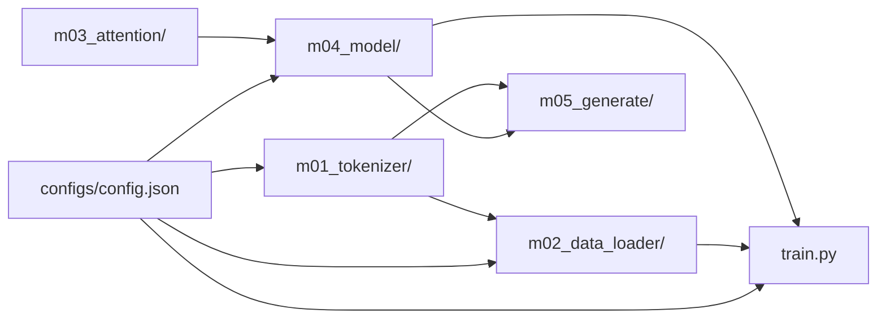

# 理解大语言模型：第一章在学什么，以及「造一个 LLM」的流程

如果你在读 Sebastian Raschka 的《Build a Large Language Model (From Scratch)》，第一章 *Understanding Large Language Models* 几乎**没有主章节代码**：它先回答「这本书要带你造什么」和「各章如何连成一条链」。本文在那一层共识之上，**重点说明从零构建一台（小型）大语言模型的流程**，并对照本仓库 **`team-mini-llm`** 的目录，方便你读代码时始终知道「当前模块在流水线里的位置」。

原书配套代码：[llms-from-scratch](https://github.com/rasbt/LLMs-from-scratch)（[第一章说明](https://github.com/rasbt/LLMs-from-scratch/tree/main/ch01)）。

---

## 一、先统一一句话：我们在「构建」什么

在本书叙事里，你要构建的是：**一个能在大量文本上学习、并根据已有 token 预测下一个 token 的神经网络**。训练阶段的目标通常是「下一词预测」；推理阶段则是把同一套预测反复接龙，形成续写或对话。第一章做的是建立这种**自回归**直觉，而不是立刻展开矩阵维度。

---

## 二、重点：从零构建大型语言模型的典型流程

可以把「构建」理解成一条**从语料到可运行模型**的流水线。下面按**顺序**列出，每一步的产出都是下一步的输入；漏掉任何一环，后面要么跑不通，要么无法复现。

### 1. 配置与约束（先立规矩）

在写模块之前，需要先固定：**词表大小、上下文长度、层数、头数、批大小、学习率、数据从哪来**等。实践中通常集中在一份配置里（本项目中为 `configs/config.json`），避免魔法数散落在各处。这样做的原因和第一章强调的「先理解整体再写代码」一致：先有**契约**，各模块才能并行实现、最后拼接。

### 2. 文本 → Token（分词与词表）

原始文本必须变成**整数序列**：神经网络只能对张量做运算，不能直接「吃」字符串。分词器（如 BPE）维护一张**词表**，每个可能的片段（子词/符号）有一个编号 `0 … V-1`，文本就被编码成这些编号组成的序列。

模型在每个位置上要回答的问题是：**「下一个片段应该是词表里哪一个？」** 因此输出层会给出长度为 `V` 的 **logits** 向量（`V` 即词表大小），经 softmax 后得到在 `V` 个类别上的概率分布。这与「`V` 类分类」是同一套数学：真实下一个 token 的编号就是类别标签，交叉熵损失就是在惩罚预测分布与这个标签的差异。

所以 **词表大小 `V` 必须等于语言模型头（lm head）的输出维度**：最后一层有多少个神经元，就代表有多少个「候选下一词」；分词器与模型若各用一套不同的 `V`，形状对不上，训练无法定义。

**本项目对应**：`src/mini_llm/m01_tokenizer/`（包内 `__init__.py`，例如基于 tiktoken 的 GPT-2 编码）。

### 3. Token 序列 → 训练样本（滑动窗口与划分）

在一条长 token 序列上，用固定长度 `T` 的窗口滑动，构造「输入序列 / 目标序列」（目标常为输入右移一位），再划分训练集与验证集，并封装成可批量的 `Dataset` / `DataLoader`。

**本项目对应**：`src/mini_llm/m02_data_loader/`；窗口长度与 `config` 中的 `context_length` 对齐。

### 4. 批次 →  logits（模型前向）

将形状为 `[批量 B, 时间步 T]` 的 token 张量送入模型：嵌入、位置信息、若干 Transformer 块（自注意力 + 前馈）、层归一化，得到每个位置上对「下一个 token」的未归一化分数 **logits**，形状为 `[B, T, 词表大小]`。

**本项目对应**：`src/mini_llm/m03_attention/`（多头因果注意力）、`src/mini_llm/m04_model/`（Transformer 块与 `GPTModel`）。

### 5. logits → 损失 → 更新（预训练循环）

用交叉熵把「模型预测的下一词分布」与「真实下一个 token」对齐，反向传播，用优化器更新参数；周期性在验证集上算损失，并把检查点写到磁盘，便于恢复与推理。

**本项目对应**：仓库根目录 `train.py`（读取配置、设备、优化器、训练/验证循环、checkpoint）。

### 6. 检查点 → 文本（生成）

加载训练好的权重，从一段 prompt 的 token 出发，反复「预测下一个 token」并拼回序列；可通过 temperature、top-k 等策略控制随机性。

**本项目对应**：`src/mini_llm/m05_generate/`。

---

### 流程总览（数据与控制流）

下面这张图概括 **team-mini-llm** 中模块之间的依赖关系，与上面六步一一对应：

读代码时的实用技巧：**从 `train.py` 顺着调用链往回看**，你会看到配置如何进入数据与模型；**从 `m05_generate/` 看推理**，你会看到训练与生成共享 tokenizer 与同一套模型结构。

---

## 三、和教材章节的对应关系（便于排期）

| 流水线环节 | 教材上大致对应 | 本仓库主要位置 |
|------------|----------------|------------------|
| 分词与数据 | 第 2 章 | `m01_tokenizer/`、`m02_data_loader/` |
| 注意力 | 第 3 章 | `m03_attention/` |
| GPT 结构 | 第 4 章 | `m04_model/` |
| 预训练 | 第 5 章 | `train.py` |
| 生成与后续任务 | 第 4 章（生成）+ 第 6/7 章（微调扩展） | `m05_generate/` |

同级目录下的官方仓库 **LLMs-from-scratch** 仅作**对照阅读**，避免与自研代码混在同一包内；具体路径索引见仓库根目录 `REFERENCE.md`。

---

## 四、第一章本身在流程里的角色

第一章**不写这条流水线的实现**，但让你带着「流程图」去读第二章及以后：没有这张图，很容易把 `DataLoader`、注意力、损失当成孤立知识点。官方仓库也说明第一章**没有 Main Chapter Code**，只有环境、视频等可选材料——目的是**先统一术语与路线图，再进入分词与数据**。

---

## 五、小结

- **构建 LLM（在本书语境下）** = 配置 → 分词 → 批数据 → 模型前向 → 预训练循环 → 生成与（可选）微调。  
- **理解本项目** = 把 `src/mini_llm/` 下各子包对应到上述环节；配置单点、张量形状与损失接口一致，整条链就能在 `train.py` 里闭合。  
- **第一章** = 在动手前确认「造的是什么」和「章节顺序即流水线顺序」，为后面每一章提供坐标系。

---

*具体小节标题与插图以你所持正版图书为准；本文中的流程描述与 `team-mini-llm` 仓库结构一致，便于团队内部与博客同步使用。*
